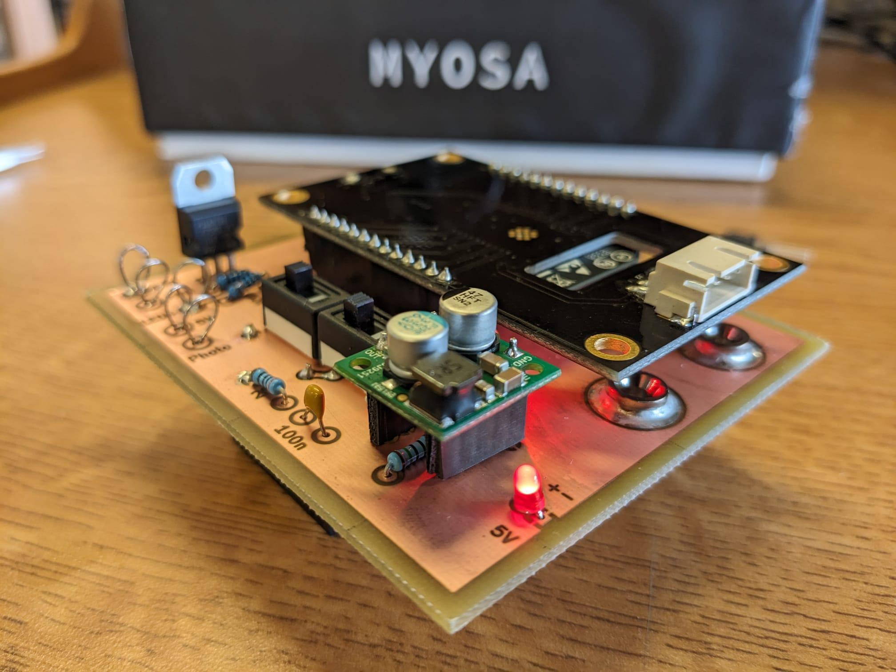

<!-- MYOSA Project Submission Guidelines (For Participants)
This document outlines the mandatory submission format and rules that all participants must strictly follow while uploading their project to the official MYOSA GitHub repository. Submissions that do not follow this format may be rejected or asked for resubmission.
1. Submission Format (Mandatory)
Each participant/team must upload a single Markdown (.md) file following the exact structure below:
---
publishDate: 2026-08-25

title: BreathSense - MYOSA Musical Breath Activity

excerpt: Short 1–2 line description of your project

This project uses CO2 detection as a proxy for musical activity. Mid-Wave Infrared (MWIR) light at a wavelength absorbed by CO2 is shone through the mouthpiece of a woodwind/brass instrument. 

image: Project_Folder_Name /your-cover-image.jpg

tags:
  - Tag1
  - Tag2
  - Tag3
---

> One-line project tagline 
Real-time breath monitoring, built for the way musicians breathe and perform.

--- -->

## BreathSense - MYOSA Musical Breath Activity

<p align="center">
  <br/>
  <i>Placeholder cover image</i>
</p>

## Acknowledgements

- Dr. Vincenzo Pusino
- Ben Allen
- University of Glasgow
- University of Glasgow Technical Staff

## Overview

Musicians rely heavily on breath control to shape dynamics, phrasing, tone and endurance, yet there are few accessible ways to measure breathing behaviour objectively during real performance. This project develops a real-time breath monitoring system designed specifically for musicians, using exhaled CO₂, pressure and temperature data to provide direct insight into how breath is being used while playing. The system is built around the MYOSA development board, providing an IoT-capable platform for sensor integration, wireless communication and real-time data logging. A custom Non-Dispersive Infrared (NDIR) CO₂ sensing system detects exhaled breath, while pressure and temperature measurements provide complementary information about breath activity and environmental variation. By combining these sensing methods with wireless data transmission and live visualisation, the project aims to provide musicians, teachers and researchers with a practical tool for analysing breath strength, timing and consistency during practice and performance.

#### Key Features

  - Custom NDIR CO₂ Sensor to allow most direct measurement. 
  - Pressure sensor for additional cross validation data and enhanced insights. 
  - Built on the MYOSA MCU platform, small enough to clip to a belt or pocket, streaming data live
  - On device OLED display for seeing quick analytics 
  - Python bassed WiFi/IoT system enabling cloud computing for in deapth real time signal processing.


## Demo / Examples

### Images

<p align="center">
  <br/>
  <i>Placeholder cover image</i>
</p>

### Videos

<!-- Participants must: - Upload their video as a local .mp4 file - Place it in the same folder as the markdown file
Correct Video Format -->
<!-- <video controls width="100%">
  <source src="./Better_Demo_of_CO2_Detection.mp4" type="video/mp4">
</video> -->

<video src="./Better_Demo_of_CO2_Detection.mp4" controls width="100%"></video>

## Features (Detailed)

<!-- QUICK NOTES:
- Custom NDIR CO₂ Sensing system, combining a pulsed MWIR LED and a photodiode with a peak sensitivity wavelength corresponding to the peak emitted wavelength of the LED. The CO₂ absorbs some of the emitted IR light and thus can be detected from a drop in signal  from the photodiode. 
- BMP180 corroborates the breath detection by monitoring the pressure changes within the mouthpiece. It also monitors the temperature changes within the mouthpiece so drift can be accounted for. 
- A real time capnogram enables the chnages in CO₂ to be plotted and monitored by the user as a proxy for the strenth and consitency of their breath. 
- The wireless capabilites of  the MYOSA are leveraged so the data  collected can be sent over WiFi to an external device to be plotted, increasing the ease of use and portability of the device. This also enables data to be logged and stored by the user. 

ACTUAL:  -->
## 1. NDIR CO₂ Sensing
  - why co2 as proxy for breath
  - MWIR wavelength used
  - pulsed LED
  - photodiode detection and analog front end 
  - co2 absorbs part of the optical signal. 
  - Circuitry 


<video controls width="100%">
  <source src="Better_Demo_of_CO2_Detection.mp4" type="video/mp4">
</video>


## 2. Pressure and Temperature Sensing
  - pressure change provides an independant measure of breath
  - temperature measurement helps mitigate environmental effects and thermal drift 
  - BMP180 from minkit connects via I2C to MYOSA board. 

## 3. MYOSA Integration 
  - Master board circuitry 
  - Reads sensors and controls the pulsing
  - Wireless streaming to external computer 

## 4. Real-Time Visualisation
  - Python Desktop interface
  - PyQt GUI

## 5. Potential Musical Application

## Usage Instructions

The final version of the device is envisioned to work like so:

- Attach mouthpiece to wind instrument and place MYOSA in pocket/hook to belt
- Run accompanying app on phone/computing device
- Allow hardware a few seconds unplayed to callibrate CO2 background level
- Practise instrument as normal, playing along to sheet music on app
- Compare breath activity in app in realtime and/or observe collected data at end of piece

## Tech Stack

### Hardware

| Component | Part | Role |
|---|---|---|
| MCU / wireless | MYOSA development board | Master controller — drives sensing, fuses data, streams wirelessly to host computer/Cloud |
| CO₂ emitter | L15895-0430MA LED | Pulsed mid-wavelength infrared (MWIR) source, tuned to a CO₂ absorption band |
| CO₂ detector | P16112-011MA photodiode | Measures transmitted IR intensity after passing through the breath sample |
| Pressure / temperature | BMP180 (Minkit breakout) | I²C sensor providing an independent breath-pressure signal and temperature compensation |
| Mechanical | 3D-printed trombone mouthpiece | Directs exhaled breath through the sensing chamber; mounts sensor package in the airflow path (Bassed on Popular Bach 12C Design) |
| PCB | Custom board (see `KiCAD/`) | Houses the analog front end and sensor interconnects |

#### Analog Front End

The CO₂ channel is the most sensitive part of the hardware, since NDIR absorption signals are small relative to the raw photodiode output. The front end is built around a **pulsed detection scheme**:

1. **LED pulsing** — the MWIR LED is driven in short pulses (rather than continuously) by the MYOSA board. Pulsing reduces average power draw and, more importantly, lets the readout distinguish the LED's signal from ambient IR and photodiode drift.
2. **Photodiode readout** — the photodiode's current output is converted to a voltage via a transimpedance amplifier (TIA), since photodiode signals are typically too small and too high-impedance to read directly with an ADC.
3. **Filtering** — the amplified signal is filtered to reject noise outside the LED's pulse frequency and suppress ambient light interference.
4. **Synchronous sampling** — the MYOSA board samples the photodiode signal in sync with the LED pulse (on-pulse vs off-pulse), allowing the background/ambient signal to be subtracted from the CO₂-modulated signal. This differential approach is what makes the CO₂ absorption measurable despite a noisy optical environment.
5. **Digitisation** — the conditioned analog signal is read via the MYOSA board's ADC and combined in firmware with the BMP180's I²C readings.

### Software

**Firmware — Arduino C++ (runs on MYOSA)**
- Drives LED pulse timing and synchronises photodiode ADC sampling with each pulse
- Polls the BMP180 over I²C for pressure and temperature
- Fuses CO₂, pressure, and temperature readings into a single timestamped data frame
- Streams the fused data frame wirelessly to the host computer

**Desktop application — Python + PyQt**
- Listens for the incoming data stream from the MYOSA board and parses each frame into CO₂, pressure, and temperature values
- Does inhanced signal processing and filtering
- Plots all three channels live using PyQt's graphing widgets, updating in real time as the musician plays
- Buffers session data for post-session review, and (per the Usage Instructions) supports comparing breath activity against sheet music playback


## Requirements / Installation

**Dependencies** are listed in `requirements.txt` — install with:
```bash
pip install -r requirements.txt
```

<!-- 2. Image Upload Rules
All images must: - Be placed in the same folder as your .md file - Use JPG or PNG format only - Be properly named (no spaces)
Correct Image Format
<p align="center">
  <br/>
  <i>Assembled test breakout board for integrating the MYOSA with external hardware.</i>
</p>
3. Video Upload Rules (Important)
YouTube links are NOT allowed.

4. Content Rules
Each project must clearly explain: - What the project does - How it works - Who it is for - What problem it solves
Must Include:
●	Proper overview
●	Real images & demo video
●	Tech stack used
●	Working instructions -->

<!-- 5. Code & Technical Content
Participants may include: - Python, C/C++, JavaScript, or Embedded code - Installation commands
Correct Code Format
print("Hello MYOSA")
6. File & Folder Naming Rules
●	No spaces in file names
●	Use lowercase
Good Example:
myosa-smart-home.md
myosa-demo.mp4
myosa-dashboard.jpg
Bad Example:
My Project Final.md
Demo Video.mp4 -->
<!-- 7. Common Mistakes That Lead to Rejection
Using YouTube links instead of local videos
Missing cover image
Not following the fixed markdown format
Poor explanation of project
Missing tech stack
Wrong file structure
8. Submission Checklist (Final)
Before submitting, confirm: 
●	Markdown file format followed
 Images added correctly
 MP4 video uploaded
 Proper overview written
 Tech stack added
 Commands & code formatted correctly
9. Submission Responsibility
By submitting a project, the participant confirms that: - The work is original - The content follows open-source ethics - No copyrighted material is used without permission
10. Organizer Final Note
This format is mandatory for all participants. Failure to follow the guidelines may result in: - Rejection of submission - Request for resubmission - Disqualification in case of repeated violation
Sample Format:
---
publishDate: YYYY-MM-DDT00:00:00Z
title: Your Project Title
excerpt: A short 1–2 sentence summary describing what the project does.
image: your-cover-image.jpg    # optional but recommended
tags:
  - tag1
  - tag2
  - tag3
---
> A short tagline that summarizes the project in one sentence.
--- -->
<!-- ## Features (Detailed)
Explain in detail how the project works.  
Break it into clear subsections like below.
### **1. Feature Heading Example**
Explain the feature.
### **2. Feature Heading Example**
Explain the feature.
### **3. Feature Heading Example**
Explain the feature.
Add images or videos under each subsection if needed using the formats above.
---
## Usage Instructions
Explain how others can use this project.
If there are commands, show them like this:
```plaintext
python your_script.py --option value
```
If there are scripts, use:
```python
# Example Python snippet
def example():
    print("Hello World")
``` -->
## License MIT License

Copyright (c) 2026 aidanmacro

Permission is hereby granted, free of charge, to any person obtaining a copy of this software and associated documentation files (the "Software"), to deal in the Software without restriction, including without limitation the rights to use, copy, modify, merge, publish, distribute, sublicense, and/or sell copies of the Software, and to permit persons to whom the Software is furnished to do so, subject to the following conditions:

The above copyright notice and this permission notice shall be included in all
copies or substantial portions of the Software.

THE SOFTWARE IS PROVIDED "AS IS", WITHOUT WARRANTY OF ANY KIND, EXPRESS OR IMPLIED, INCLUDING BUT NOT LIMITED TO THE WARRANTIES OF MERCHANTABILITY, FITNESS FOR A PARTICULAR PURPOSE AND NONINFRINGEMENT. IN NO EVENT SHALL THE AUTHORS OR COPYRIGHT HOLDERS BE LIABLE FOR ANY CLAIM, DAMAGES OR OTHER LIABILITY, WHETHER IN AN ACTION OF CONTRACT, TORT OR OTHERWISE, ARISING FROM, OUT OF OR IN CONNECTION WITH THE SOFTWARE OR THE USE OR OTHER DEALINGS IN THE
SOFTWARE.
